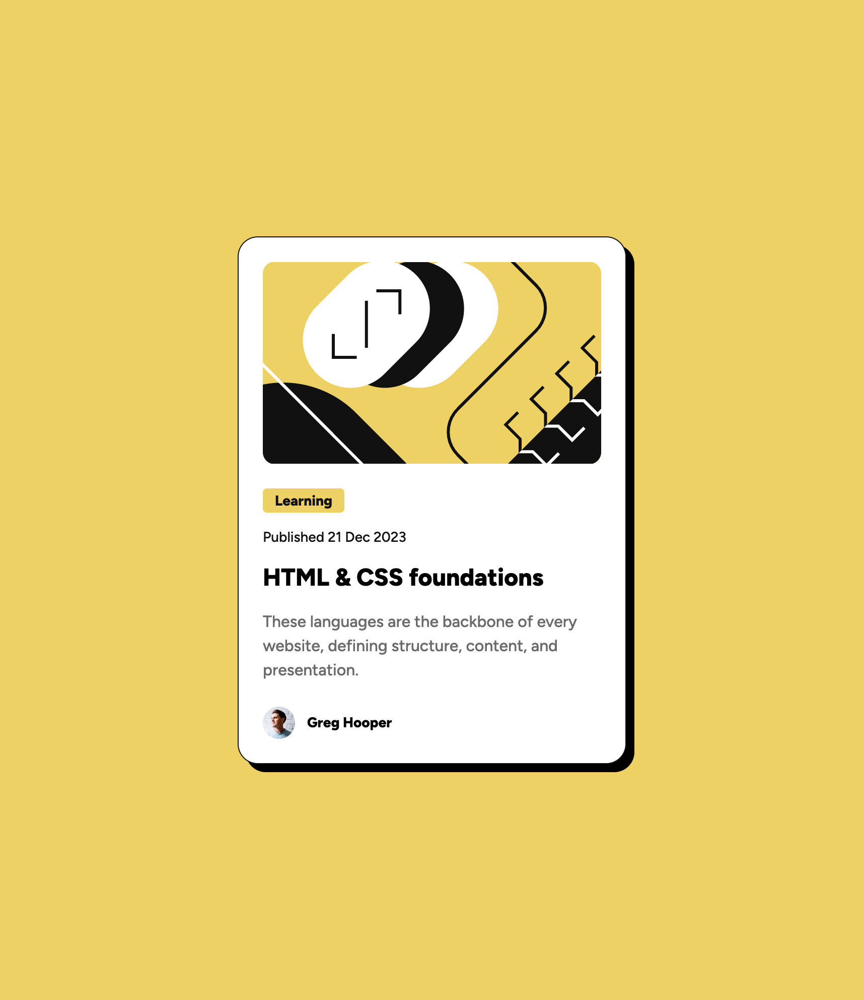

# Frontend Mentor - Blog preview card solution

This is a solution to the [Blog preview card challenge on Frontend Mentor](https://www.frontendmentor.io/challenges/blog-preview-card-ckPaj01IcS). Frontend Mentor challenges help you improve your coding skills by building realistic projects. 

## Table of contents

- [Overview](#overview)
  - [The challenge](#the-challenge)
  - [Screenshot](#screenshot)
  - [Links](#links)
- [My process](#my-process)
  - [Built with](#built-with)
  - [What I learned](#what-i-learned)
- [Author](#author)

## Overview

### The challenge

Users should be able to:

- See hover and focus states for all interactive elements on the page

### Screenshot



### Links

- Solution URL: [https://github.com/hackz101/blog-preview-card-main](https://github.com/hackz101/blog-preview-card-main)
- Live Site URL: [https://blog-preview-card-main-nine-ruddy.vercel.app/](https://blog-preview-card-main-nine-ruddy.vercel.app/)

## My process

### Built with

- Semantic HTML5 markup
- CSS custom properties
- CSS Grid
- Responsive design
- [Normalize.css](https://necolas.github.io/normalize.css/) - For CSS resets

### What I learned

In this challenge, I reinforced what I already learned about using a grid to center a card on the screen and reapplied it here. I also used display grid so that I could not only make the user picture and name horizontally aligned, but vertical as well.

```html
<footer class="user-info">
  
  <p class="user-name">Greg Hooper</p>
</footer>
```
```css
.user-info {
  display: grid;
  column-gap: 0.75rem;
  grid-template-columns: min-content 1fr;
  align-items: center;
}
```

## Author

- Frontend Mentor - [@hackz101](https://www.frontendmentor.io/profile/hackz101)